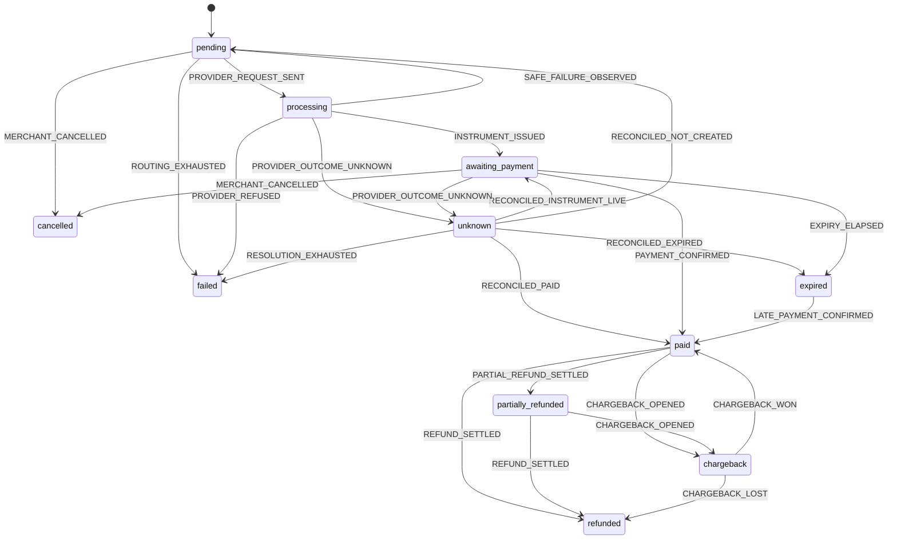

<!-- Generated by scripts/verify-docs.mjs. Do not edit by hand. -->

# Payment lifecycle

A payment holds one of 11 statuses, and exactly 24 status-changing edges are declared in `apps/api/src/domain/payment/payment-transition-table.ts`. That table is the single source of truth: the state machine and this document are both derived from it, and CI fails if they disagree.

Of the 110 ordered pairs of distinct statuses, only the edges below are permitted. The test suite enumerates the full Cartesian product of statuses and triggers rather than sampling it.

## Statuses

| Status | Terminal | Funded | Can move to |
| --- | --- | --- | --- |
| `pending` | no | no | `processing`, `cancelled`, `failed` |
| `processing` | no | no | `awaiting_payment`, `failed`, `unknown`, `pending` |
| `unknown` | no | no | `awaiting_payment`, `pending`, `paid`, `expired`, `failed` |
| `awaiting_payment` | no | no | `paid`, `expired`, `cancelled`, `unknown` |
| `paid` | no | yes | `partially_refunded`, `refunded`, `chargeback` |
| `partially_refunded` | no | yes | `refunded`, `chargeback` |
| `refunded` | yes | yes | — |
| `chargeback` | no | yes | `paid`, `refunded` |
| `expired` | no | no | `paid` |
| `failed` | yes | no | — |
| `cancelled` | yes | no | — |

## Transitions

| # | From | To | Trigger | Minimum evidence | Why |
| --- | --- | --- | --- | --- | --- |
| 1 | `pending` | `processing` | `PROVIDER_REQUEST_SENT` | `internal` | A provider has been selected and the request is in flight. |
| 2 | `pending` | `cancelled` | `MERCHANT_CANCELLED` | `internal` | The merchant withdrew the payment before any provider was contacted. |
| 3 | `pending` | `failed` | `ROUTING_EXHAUSTED` | `internal` | No configured provider can serve this payment. |
| 4 | `processing` | `awaiting_payment` | `INSTRUMENT_ISSUED` | `authenticated_provider_read` | The provider returned a payable instrument and the customer may now pay. |
| 5 | `processing` | `failed` | `PROVIDER_REFUSED` | `authenticated_provider_read` | The provider refused the payment outright and created nothing. |
| 6 | `processing` | `unknown` | `PROVIDER_OUTCOME_UNKNOWN` | `internal` | The provider call did not produce a usable answer. Whether anything was created is unknown, so no failover is permitted until it is resolved. |
| 7 | `processing` | `pending` | `SAFE_FAILURE_OBSERVED` | `authenticated_provider_read` | The provider confirmed it created nothing, so another provider may be attempted. |
| 8 | `unknown` | `awaiting_payment` | `RECONCILED_INSTRUMENT_LIVE` | `authenticated_provider_read` | Reconciliation found a live instrument from the uncertain attempt. |
| 9 | `unknown` | `pending` | `RECONCILED_NOT_CREATED` | `authenticated_provider_read` | Reconciliation proved nothing was created, which is the only condition under which failover is safe. |
| 10 | `unknown` | `paid` | `RECONCILED_PAID` | `authenticated_provider_read` | Reconciliation found the uncertain attempt had in fact been paid. |
| 11 | `unknown` | `expired` | `RECONCILED_EXPIRED` | `authenticated_provider_read` | Reconciliation found the uncertain instrument had lapsed unpaid. |
| 12 | `unknown` | `failed` | `RESOLUTION_EXHAUSTED` | `operator` | The uncertainty could not be resolved within its window and an operator closed it. |
| 13 | `awaiting_payment` | `paid` | `PAYMENT_CONFIRMED` | `authenticated_provider_read` | The provider confirmed, on an authenticated read, that the customer paid. |
| 14 | `awaiting_payment` | `expired` | `EXPIRY_ELAPSED` | `authenticated_provider_read` | The instrument lapsed without payment. |
| 15 | `awaiting_payment` | `cancelled` | `MERCHANT_CANCELLED` | `internal` | The merchant withdrew the payment while it was still unpaid. |
| 16 | `awaiting_payment` | `unknown` | `PROVIDER_OUTCOME_UNKNOWN` | `internal` | The provider stopped answering, so the instrument state is no longer known. |
| 17 | `expired` | `paid` | `LATE_PAYMENT_CONFIRMED` | `authenticated_provider_read` | The customer paid after the instrument lapsed. The money arrived, so it is recorded rather than denied. |
| 18 | `paid` | `partially_refunded` | `PARTIAL_REFUND_SETTLED` | `authenticated_provider_read` | Part of the captured amount was returned. |
| 19 | `paid` | `refunded` | `REFUND_SETTLED` | `authenticated_provider_read` | The whole captured amount was returned. |
| 20 | `paid` | `chargeback` | `CHARGEBACK_OPENED` | `authenticated_provider_read` | The issuing bank reversed the payment and a dispute is open. |
| 21 | `partially_refunded` | `refunded` | `REFUND_SETTLED` | `authenticated_provider_read` | The remainder was returned, so nothing is left captured. |
| 22 | `partially_refunded` | `chargeback` | `CHARGEBACK_OPENED` | `authenticated_provider_read` | A dispute was opened over what remains captured. |
| 23 | `chargeback` | `paid` | `CHARGEBACK_WON` | `authenticated_provider_read` | The dispute was resolved in the merchant’s favour. |
| 24 | `chargeback` | `refunded` | `CHARGEBACK_LOST` | `authenticated_provider_read` | The dispute was lost and the money returned to the customer. |

## Diagram

## Decisions worth knowing

- **No edge leaves a terminal status.** A late event arriving against a finished payment is recorded and reported, never applied. Resurrecting a terminal payment is the bug class that double-credits a merchant.
- **`expired` is deliberately not terminal.** A Pix code can be paid moments after it lapses. The money genuinely arrives, so `expired -> paid` exists; refusing it would be losing the customer’s payment.
- **Every transition into a funded status demands an authenticated provider read.** Appmax webhooks carry no signature of any kind, so a webhook may only schedule a read. It can never fund a payment by itself.
- **`unknown` is a first-class status.** A provider call that did not produce a usable answer means it is unknown whether anything was created. The only route from `unknown` back to `pending` — the status in which another provider may be attempted — is `RECONCILED_NOT_CREATED`, which is proof that nothing exists to be paid twice.
